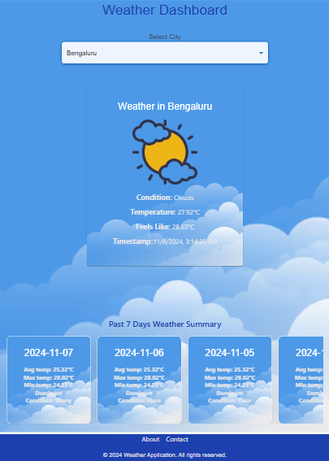

# Weather Monitoring App
A real-time Weather Monitoring application designed for tracking, processing, and visualizing weather data from multiple cities. This app offers configurable data retrieval, dynamic visualizations, alerts for extreme weather conditions, and a streamlined user interface for exploring weather trends.

# Table of Contents
Features
Technology Stack
Getting Started
Endpoints
Configuration
Screenshots
License
# Features
1. Real-Time Data Retrieval
Fetches weather data from the OpenWeatherMap API every configurable interval (e.g., 5 minutes).
Data includes fields like temperature, main weather conditions, and timestamps, ensuring comprehensive weather insights.
2. Data Processing & Conversion
Converts temperature data from Kelvin to Celsius.
Processes data based on user-configured preferences, including specific weather conditions and time intervals.
3. Daily Weather Summaries
Aggregates data to generate daily summaries, including:
Average Temperature
Maximum Temperature
Minimum Temperature
Dominant Weather Condition for each day
Summaries provide a quick overview of daily weather trends.
4. Historical Trends
Access historical weather data with detailed insights and trends.
Includes temperature variations and weather conditions over previous days, enabling users to track seasonal changes.
5. User-Configurable Alerting System
Allows users to set custom thresholds for weather conditions.
Real-time alerts trigger when thresholds are met (e.g., temperature exceeding 35°C for two consecutive updates).
Notifications are sent through the app interface, enhancing user awareness of extreme weather conditions.
6. Interactive Data Visualization
Visualize data using an intuitive UI built with Vite, Tailwind CSS, and Material UI.
Includes charts and graphs for daily summaries, historical data, and real-time alerts.
Mobile-optimized for seamless access on any device.
7. Responsive UI
Clean, modern, and user-friendly interface with React and Material UI components.
Displays data clearly and efficiently, optimized for both desktop and mobile views.
8. RESTful API Integration
Provides RESTful endpoints to retrieve weather summaries, daily data, and real-time alerts.
API endpoints are straightforward and organized, allowing for easy integration with other applications or extensions.
# Technology Stack
Backend: Java 1.8, Spring Boot, MySQL
Frontend: React, Vite, Tailwind CSS, Material UI
Data Processing: OpenWeatherMap API, JSON
Deployment: Docker (for containerization)
Alerts: Configurable thresholds and real-time notifications
Getting Started
To get started with this project locally, follow these steps:

Clone the Repository:

bash
Copy code
git clone https://github.com/username/weather-monitoring-app.git
cd weather-monitoring-app
Configure the Application:

Set up environment variables for the OpenWeatherMap API key and database credentials.
Run Docker:

Build and run the Docker container for easy deployment.
bash
Copy code
docker build -t weather-app .
docker run -d -p 8080:8080 weather-app
Access the Application:

Open your browser and navigate to http://localhost:8080.
# Endpoints
Below are the primary API endpoints:

GET /api/weather/today: Retrieves today’s weather summary.
GET /api/weather/{date}: Fetches weather data for a specific date.
GET /api/weather/summary/weekly: Provides a summary of the past 7 days.
POST /api/alerts/configure: Configures alert thresholds based on temperature or weather conditions.
GET /api/alerts/notifications: Fetches the current active alerts.
Configuration
The following configurations are available:

API_KEY: Your OpenWeatherMap API key.
Refresh Interval: Set the interval (in minutes) for fetching new weather data.
Alert Thresholds: Define thresholds for temperature and weather conditions to trigger alerts.
# Screenshots

    

# React + Vite

This template provides a minimal setup to get React working in Vite with HMR and some ESLint rules.

Currently, two official plugins are available:

- [@vitejs/plugin-react](https://github.com/vitejs/vite-plugin-react/blob/main/packages/plugin-react/README.md) uses [Babel](https://babeljs.io/) for Fast Refresh
- [@vitejs/plugin-react-swc](https://github.com/vitejs/vite-plugin-react-swc) uses [SWC](https://swc.rs/) for Fast Refresh
